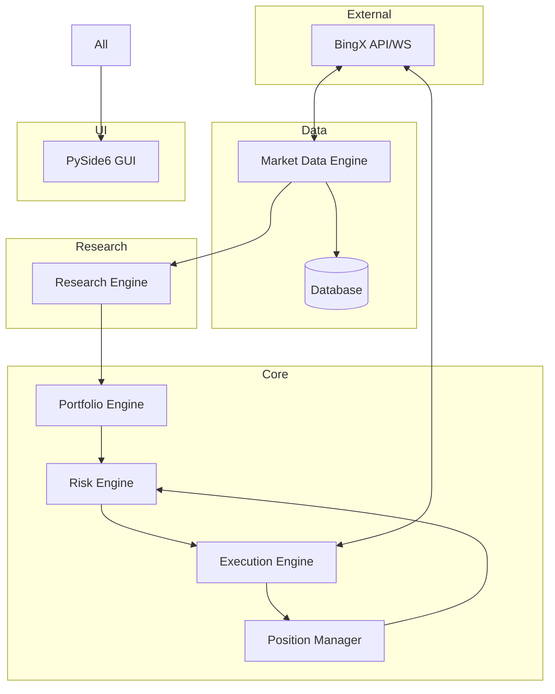

# Phase 1: System Architecture

## High-Level Architecture

The platform follows a modular, event-driven, microservices-like architecture within a single process for performance, with clear separation of concerns.

### Core Principles
- **Event-Driven**: All components communicate via async event bus.
- **Dependency Injection**: Using dependency-inject or custom DI.
- **Async-First**: asyncio for I/O bound operations.
- **SOLID & Clean Architecture**: Domain, Application, Infrastructure layers.
- **Observability**: Comprehensive logging, metrics, tracing.

## Layers
1. **Infrastructure Layer**
   - Exchange API clients
   - Database
   - Websockets
   - Logging

2. **Domain Layer**
   - Models: Trade, Position, Strategy, Signal, etc.
   - Business logic independent of tech.

3. **Application Layer**
   - Engines: Research, Portfolio, Risk, Execution, etc.
   - Orchestration.

4. **Presentation Layer**
   - GUI (PySide6)
   - APIs if web/mobile.

## Key Components & Interactions

## Data Flow
1. Market Data -> Research -> Strategy Signals
2. Signals -> Voting -> Execution (risk checked)
3. Execution -> Position Mgmt -> Monitoring

## Technologies
- Python 3.13
- asyncio, aiohttp
- SQLAlchemy 2.0 async
- PySide6
- TA-Lib, pandas, numpy, scikit-learn, PyTorch/TensorFlow
- etc.

## Configuration
Environment-based with Pydantic settings.

**End of Phase 1**
Architecture defined. Ready for implementation.